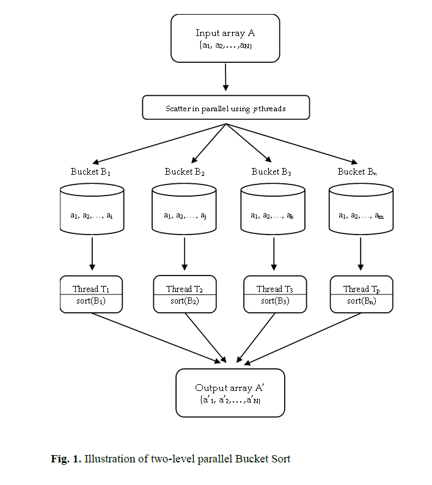
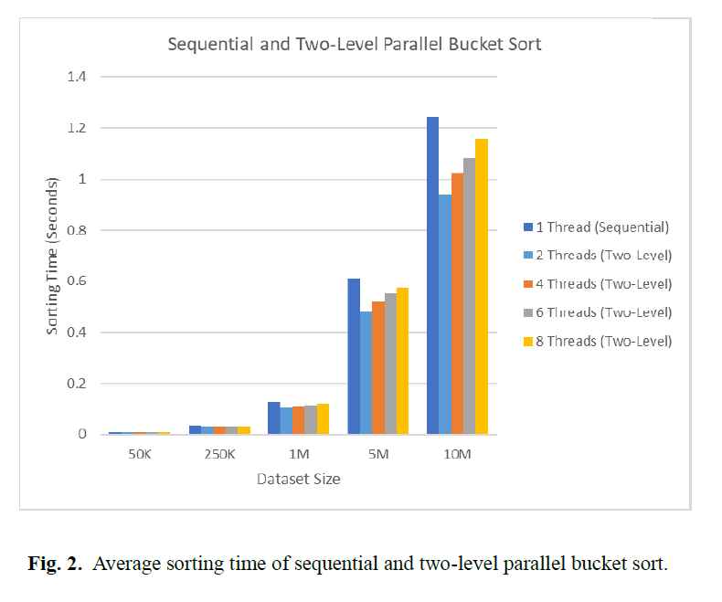

# Two-Level Parallel Bucket Sort

This project demonstrates a **Two-Level Parallel Bucket Sort Algorithm** implemented in C++ using **OpenMP** for parallelization. The algorithm efficiently sorts large datasets by utilizing multiple threads, showcasing its advantages over sequential sorting methods for handling large datasets.

---

## Overview


The **Two-Level Parallel Bucket Sort** algorithm performs the following steps:
1. Divides the input data into buckets based on the range of values.
2. Distributes the data into buckets in parallel.
3. Sorts each bucket in parallel using the `std::sort()` function.
4. Merges all buckets into a single sorted array.

---

## Key Features

- **Two-Level Parallelization:**
  - Parallel scatter: Distributes data into buckets across threads.
  - Parallel sort: Sorts individual buckets concurrently.
  
- **Performance Optimization:**
  - Uses OpenMP to leverage multi-core CPU architectures.
  - Reduces overhead by using efficient bucket-based distribution.

- **Scalability:**
  - Demonstrates the advantages of parallelization for datasets exceeding 1 million elements.
  - Evaluates performance across varying thread counts (1, 2, and 4 threads).

---

## Results and Insights

### Performance Graph


### Key Observations
1. **Sorting Time vs. Dataset Size:**
   - For datasets of 50K–1M elements, thread count had a minimal impact due to parallelization overhead.
   - For datasets larger than 1M, the performance gap widened significantly, with **4 threads** achieving the fastest sorting times.

2. **Sequential vs. Parallel Sorting:**
   - The two-level parallel bucket sort significantly outperforms sequential sorting for large datasets (e.g., 10M elements).
   - Sequential sorting is more efficient for smaller datasets due to reduced complexity.

3. **Thread Efficiency:**
   - Using 4 threads provided the optimal balance of performance and overhead reduction.
   - Adding more threads yielded diminishing returns.

---

## How to Run the Program

### Prerequisites
- **Compiler:** GCC with OpenMP support.
- **Build Tools:** A terminal or IDE for compiling and running C++ programs.

### Steps
1. Clone this repository:
   ```bash
   git clone https://github.com/your-username/parallel-bucket-sort.git
   cd parallel-bucket-sort
2. Compile the program:
   ```bash
   g++ -fopenmp -o parallel_bucket_sort main.cpp
3. Run the executable:
   ```bash
   ./parallel_bucket_sort

---

## Result Analysis
The graph (see above) illustrates that parallelization provides substantial performance gains for larger datasets:

4 threads achieve the fastest sorting time across most dataset sizes.
Single-threaded sorting is slower, especially for datasets larger than 1M elements.
However, the results also highlight the diminishing returns of adding more threads due to increased overhead.

## Conclusion
Efficiency: The two-level parallel bucket sort is more efficient for large datasets compared to sequential sorting.
Scalability: Adding threads improves performance but is limited by overhead and diminishing returns.
Future Enhancements: Refining thread management and exploring GPU-based parallelization using CUDA could further improve performance.
